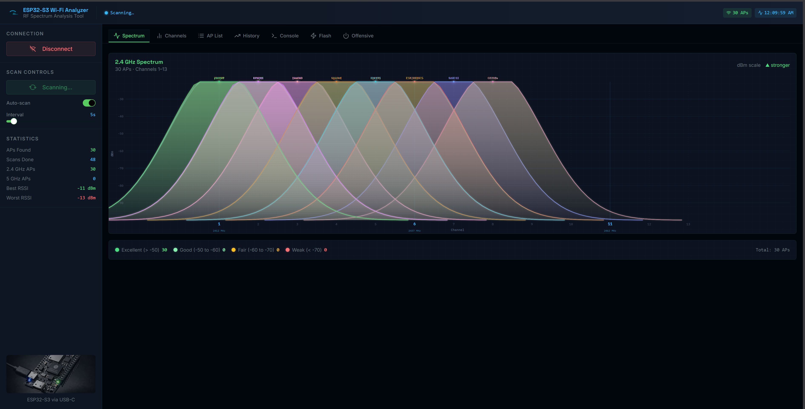
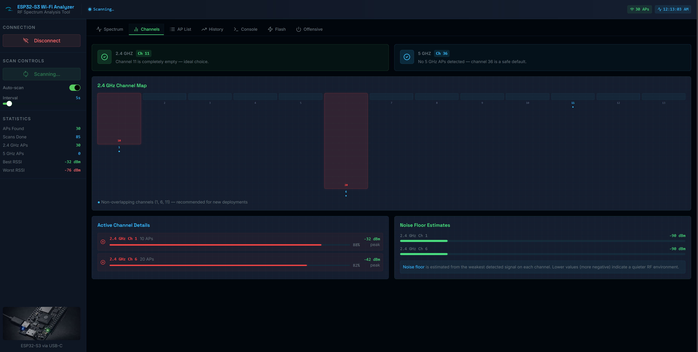
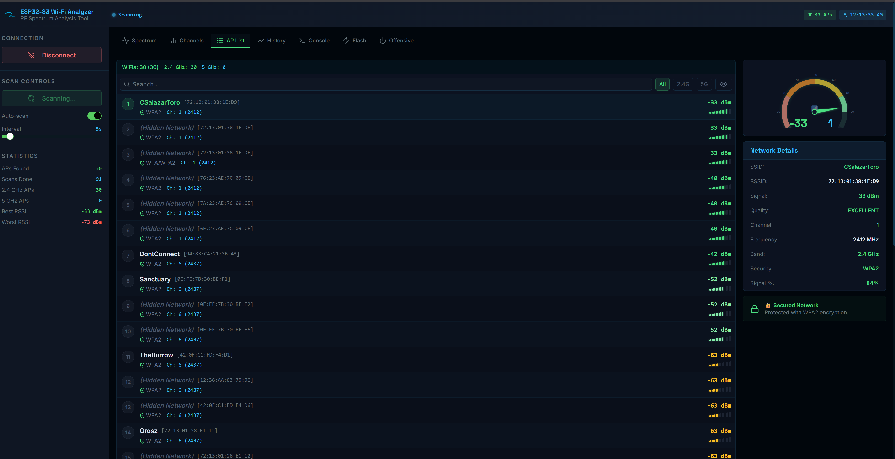
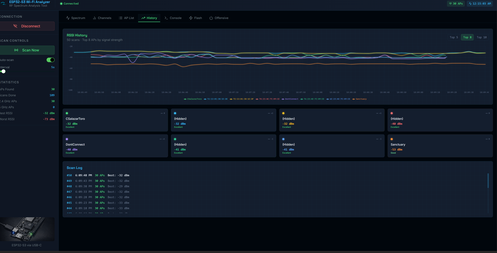
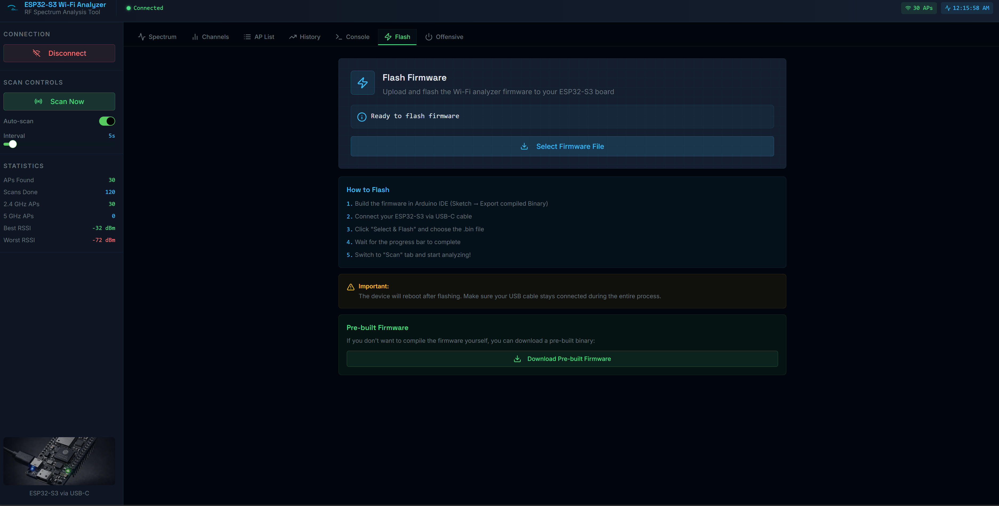
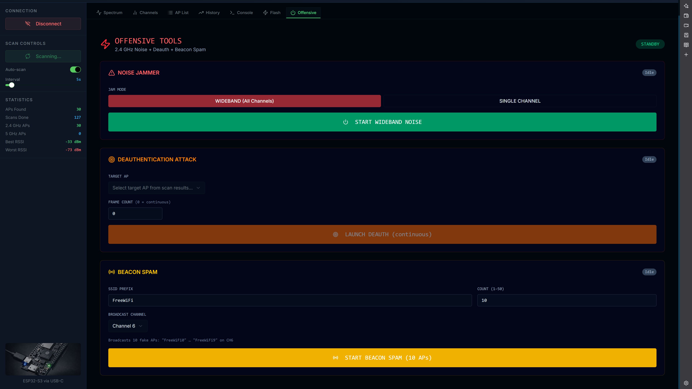

# ESP32-S3 Wi-Fi Analyzer

A real-time 2.4 GHz Wi-Fi spectrum analyzer and RF attack suite built on the ESP32-S3. Connects to your browser over WebSerial — no drivers, no installs. Scan nearby networks, visualize spectrum usage, and run offensive tools directly from the dashboard.

> **⚠️ Educational / Research Use Only.** Only operate on networks and devices you own or have explicit permission to test. Unauthorized interference with wireless communications is illegal.

---

## Features

- **Live Spectrum View** — Gaussian bell-curve visualization of every AP across channels 1–13
- **Channel Analysis** — Channel map, congestion scores, noise floor estimates, and best-channel recommendations
- **AP List** — Ranked access point table with RSSI signal gauge, encryption type, band, and full network details panel
- **Signal History** — Multi-AP RSSI trend lines over time with a scrollable scan log
- **Serial Console** — Raw serial I/O with the ESP32-S3 for debugging and manual commands
- **Firmware Flasher** — Flash firmware to the ESP32-S3 directly from the browser via WebSerial
- **Offensive Tools** — Noise jammer (wideband + single channel), 802.11 deauth attack, and beacon spam

---

## Screenshots

### Spectrum
> Live 2.4 GHz spectrum — 30 APs displayed as overlapping channel curves, color-coded by signal quality.



---

### Channel Analysis
> 2.4 GHz channel map showing AP distribution, congestion heat, active channel details, and noise floor per channel.



---

### AP List
> Ranked AP table with real-time signal bars, sortable columns, and a live arc-gauge detail panel for the selected network.



---

### Signal History
> RSSI trend lines for the top 5/8/10 APs across up to 50 scans, plus individual signal cards and a timestamped scan log.



---

### Flash Firmware
> Browser-based firmware flasher — select a `.bin` file and flash to the ESP32-S3 over USB without leaving the app.



---

### Offensive Tools
> Noise jammer, targeted 802.11 deauth attack (pick any scanned AP), and beacon spam — all with live status feedback.



---

## Hardware Requirements

| Component | Details |
|-----------|---------|
| MCU | ESP32-S3 (any board with USB) |
| Connection | USB-C to host machine |
| Browser | Chrome or Edge (WebSerial API required) |
| Antenna | Built-in PCB antenna works; external PA recommended for offensive tools |

---

## Getting Started

### 1. Flash the Firmware

**Option A — Pre-built binary (easiest):**
1. Connect your ESP32-S3 via USB-C
2. Open the app and go to the **Flash** tab
3. Click **Download Pre-built Firmware**, then **Select Firmware File** to flash it

**Option B — Build from source:**
```
firmware/wontwifi/wontwifi2.ino
```
Open in Arduino IDE, select board `ESP32S3 Dev Module`, then **Sketch → Export Compiled Binary** and flash.

### 2. Run the Dashboard

**Prerequisites:** Node.js 18+, pnpm

```bash
git clone https://github.com/Wontfallo/wontwifi.git
cd wontwifi
pnpm install
pnpm dev
```

Open [http://localhost:3000](http://localhost:3000) in **Chrome or Edge**.

### 3. Connect

1. Click **Connect** in the sidebar
2. Select your ESP32-S3 serial port from the browser prompt
3. The app auto-requests firmware info and begins scanning

---

## Firmware Serial Commands

| Command | Description |
|---------|-------------|
| `SCAN` | Trigger a single Wi-Fi scan |
| `AUTO_ON` / `AUTO_OFF` | Enable/disable automatic scanning |
| `INTERVAL <sec>` | Set auto-scan interval (1–300s) |
| `NOISE_ON` | Start wideband noise across all channels |
| `NOISE_ON <ch>` | Start noise on a single channel (1–13) |
| `NOISE_OFF` | Stop noise transmission |
| `DEAUTH_START <bssid> <ch> [count]` | Send deauth frames to target AP (`count=0` = continuous) |
| `DEAUTH_STOP` | Stop deauth attack |
| `BEACON_START [prefix] [count] [ch]` | Spam fake beacon frames (up to 50 SSIDs) |
| `BEACON_STOP` | Stop beacon spam |
| `INFO` | Report firmware version and free heap |

---

## Architecture

```
wontwifi/
├── client/              # Vite + React frontend
│   └── src/
│       ├── components/  # SpectrumChart, APTable, OffensiveTab, ...
│       ├── hooks/       # useWebSerial (WebSerial API + JSON parsing)
│       └── pages/       # Home dashboard
├── server/              # Express static file server (production)
├── firmware/
│   └── wontwifi/
│       └── wontwifi2.ino  # ESP32-S3 Arduino firmware v1.5.0
└── docs/screenshots/    # UI screenshots
```

**Communication:** The browser connects over WebSerial at 115200 baud. The firmware speaks newline-delimited JSON (`{"type":"scan","aps":[...]}`) which the `useWebSerial` hook parses and dispatches as `CustomEvent`s consumed by each component.

---

## Firmware Version History

| Version | Changes |
|---------|---------|
| 1.5.0 | Deauth attack + beacon spam (`DEAUTH_START/STOP`, `BEACON_START/STOP`) |
| 1.4.0 | Wideband + single-channel noise jammer |
| 1.0.0 | Wi-Fi scanning, auto-scan, JSON serial protocol |

---

## License

MIT — do whatever you want, just don't be evil.
